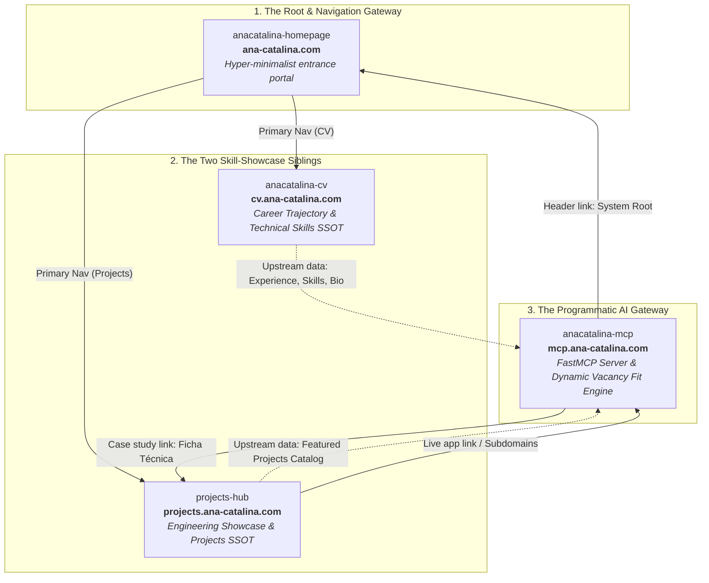

# AGENTS.md — AI Agent Guidelines & Architecture Manual

> This file provides architecture context, technical constraints, identity invariants, and operational guidelines for AI coding assistants (Gemini, Claude, Antigravity, etc.) working on this repository.

---

## Project Description

Official **Model Context Protocol (MCP)** server and interactive showcase for **Ana-Catalina Alejandra Villalobos Contardo**, Civil Engineer and Data Scientist & Machine Learning Engineer (Learning Engineer at SimpliRoute, ex-Fracttal).

The repository serves a dual-purpose architecture:
1. **Programmatic / Agent Interface:** Official FastMCP server operating over modern **Streamable HTTP** at `/mcp`, with JSON discovery at `/`. Enables AI agents (Claude.ai Custom Connectors, Gemini Connected Apps, Cursor, Windsurf) to query Ana-Catalina's professional background, skills, and projects with structured JSON responses.
2. **Human / Evaluator Interface:** A single-page web showcase served at `/demo` and transparently served at `GET /` when requested with `Accept: text/html` (browser navigation). Allows technical recruiters, evaluators, and engineering managers to explore the tools catalog, test vacancy fit benchmarks, and copy client configuration snippets directly.

**Live Production URLs:**
- Primary Custom Domain: [https://mcp.ana-catalina.com/](https://mcp.ana-catalina.com/)
- Google Cloud Run Mirror: `https://anacatalina-mcp-165536131179.us-central1.run.app/`
- MCP Streamable HTTP Endpoint: `https://mcp.ana-catalina.com/mcp`

---

## Tech Stack

| Category | Technology | Description |
| :--- | :--- | :--- |
| **Language** | Python 3.12+ | Core runtime environment |
| **MCP SDK** | `mcp>=1.3.0,<2` | Official Anthropic Model Context Protocol SDK (FastMCP) |
| **Web / ASGI Framework** | Starlette + FastAPI | High-performance async server handling SSE and HTTP negotiation |
| **Data Validation** | Pydantic v2 | Strict schema validation, typed models, and JSON serialization |
| **Templating / UI** | Vanilla HTML5 + CSS + Modern ES6 | Self-contained single-page showcase (zero Node/npm build dependencies) |
| **Containerization** | Docker | Multi-stage Debian slim container optimized for Cloud Run |
| **Deployment** | Google Cloud Run | Serverless container host with automatic scale-to-zero |
| **Test Suite** | pytest + pytest-asyncio | 100% passing automated test coverage with Starlette `TestClient` |

---

## Candidate Identity & Data Invariants (Strict Anti-Hallucination)

When generating, modifying, or querying data concerning the candidate, coding agents **MUST ALWAYS** strictly adhere to the following naming and profile invariants:

| Field | Exact Invariant Value | Rules / Constraints |
| :--- | :--- | :--- |
| **Full Legal Name** | `Ana-Catalina Alejandra Villalobos Contardo` | Official legal identity. |
| **CV / Display Name** | `Ana-Catalina Villalobos Contardo` | Standard professional heading on CVs and web apps. |
| **First Name** | `Ana-Catalina` | **CRITICAL:** Always hyphenated. NEVER use unhyphenated "Ana Catalina". |
| **Middle Name** | `Alejandra` | Second given name. |
| **Last Names** | `Villalobos Contardo` | Paternal + maternal Chilean surnames. |
| **GitHub Handle** | `AnaCataVC` | Official GitHub username. |
| **Current Headline** | `Data Scientist & Machine Learning Engineer` | Public professional headline (current SimpliRoute role title: `Learning Engineer`, since Aug 2025). |
| **Location** | `Santiago, Chile` | Base location. |
| **Contact Email** | `anacatalina@outlook.cl` | Primary contact channel. |
| **LinkedIn** | `https://linkedin.com/in/ana-catalina/` | Official LinkedIn profile. |

### Portfolio Ecosystem Links:
- **Homepage:** `https://ana-catalina.com/`
- **Interactive CV:** `https://cv.ana-catalina.com/`
- **Projects Hub:** `https://projects.ana-catalina.com/`
- **MCP Server:** `https://mcp.ana-catalina.com/`

---

## Repository Structure

```
anacatalina-mcp/
├── .agents/
│   ├── agents/
│   │   └── mcp-sync-auditor.md   # Master MCP Data Synchronization & Ecosystem Auditor Agent
│   └── skills/
│       └── sync-mcp-data/
│           └── SKILL.md          # Cross-repository data audit & sync workflow instructions
├── .github/workflows/
│   ├── test.yml                  # Test suite on push to main and PRs
│   └── upstream-drift.yml        # Daily drift audit against anacatalina-cv / projects-hub (opens an issue)
├── data/
│   └── cv_data.json              # In-memory single source of truth for the CV dataset
├── docs/
│   └── upstream-sync.md          # How the cross-repo sync and drift detection work
├── models/
│   ├── __init__.py
│   └── cv.py                     # Pydantic v2 models (PersonalInfo, ExperienceItem, Skills, etc.)
├── scripts/
│   └── sync_mcp_data.py          # Native Python data audit and synchronization utility
├── services/
│   ├── __init__.py
│   └── cv_service.py             # In-memory CVService singleton, search, and benchmark engine
├── templates/
│   ├── index.html                # Single-page Pastel-Tech showcase & deterministic playground
│   └── poppy.svg                 # Botanical poppy SVG watermark for UI background
├── tests/
│   ├── test_content_negotiation.py # 7 automated tests for root HTML/JSON content negotiation
│   ├── test_server.py            # 28 automated tests (Streamable HTTP, MCP tools, REST APIs, static assets)
│   └── test_sync_script.py       # 12 automated tests for cross-repo synchronization engine
├── Dockerfile                    # Container definition for Google Cloud Run
├── pytest.ini                    # Pytest configuration (asyncio mode)
├── requirements.txt              # Production runtime dependencies (pinned mcp<2)
├── requirements-dev.txt          # Development dependencies (pytest, pytest-asyncio, httpx)
├── server.py                     # Main entrypoint: FastMCP server, route handlers, Streamable HTTP
├── favicon.svg                   # Official ACVC geometric monogram SVG
├── favicon.ico                   # Fallback favicon
├── icon.png                      # Repository and client avatar
├── AGENTS.md                     # This file
└── README.md                     # Bilingual portfolio README
```

---

## Dynamic Job Fit Engine (In-Memory Matching)

The job fit evaluator (`evaluar_fit_puesto` tool and `/api/evaluate-fit` REST endpoint) operates via a **deterministic in-memory technology matching engine**:
- **Zero External LLM Calls at Runtime:** 100% deterministic and local, eliminating third-party API dependencies, token costs ($0.00), rate limits, and latency spikes.
- **Sub-5ms Latency:** Instant evaluation executed entirely in memory using regex-based skill boundary matching (`TECH_ALIAS_MAP`) against `data/cv_data.json`.
- **Dynamic Matching Over Fixed Scenarios:** Rather than relying on static hardcoded scenarios, the engine parses any freeform job description text, extracts matching technologies (Python, GCP, BigQuery, Vertex AI, MCP, Docker, etc.), correlates them with real accomplishments across SimpliRoute and Fracttal, and computes an objective fit score:
  - `0% (Sin Coincidencias Técnicas / Fuera de Especialidad)`: Returned when zero technical matches are detected (e.g. non-technical or completely unrelated roles), preventing false positives and hallucinations.
  - `40% - 60% (Coincidencia Parcial)`: 1 to 2 matched technologies.
  - `70% - 85% (Alta Compatibilidad)`: 3 to 4 matched technologies.
  - `90% - 95% (Alineación Excepcional)`: 5+ matched technologies.
- **Showcase Presets:** The frontend showcase (`templates/index.html`) provides 4 curated market presets (`data-science`, `logistics`, `agents`, and `pop-singer` as the negative test) for rapid evaluation demonstrations.

---

## Official MCP Tools Catalog

The FastMCP server exposes **9 official tools** via the standard MCP protocol:

| Tool Name | Parameters | Return Type | Purpose |
| :--- | :--- | :--- | :--- |
| `obtener_experiencia` | `empresa` *(str, optional)* | `List[ExperienceItem]` | Work history at SimpliRoute, Fracttal, etc., with roles, achievements, and tech stack. |
| `obtener_stack_tecnologico` | `categoria` *(str, optional)*<br/>`nivel` *(str, optional)* | `List[SkillCategory]` | Technical skill matrix (Python, SQL, BigQuery, Vertex AI, Docker) with proficiency levels. |
| `obtener_proyectos_destacados` | `tipo` *(str, optional)*<br/>`tecnologia` *(str, optional)* | `List[ProjectItem]` | Flagship personal and professional projects with architectures and demo links. |
| `evaluar_fit_puesto` | `descripcion_vacante` *(str, required)* | `FitEvaluationResult` | Dynamic vacancy fit analysis matching technologies against CV skills, returning score, strengths, and added value. |
| `buscar_en_curriculum` | `consulta` *(str, required)* | `Dict[str, Any]` | Cross-cutting keyword search across experience, skills, and projects in memory. |
| `obtener_educacion` | *None* | `List[EducationItem]` | Formal degree and academic background from Universidad de Chile. |
| `obtener_contacto` | *None* | `ContactDetails` | Direct professional contact email and LinkedIn URL. |
| `obtener_perfil` | *None* | `PersonalInfo` | General profile: display name, first/middle/last names, full name, headline, location, and GitHub. |
| `obtener_resumen_ejecutivo` | `idioma` *(str, default="es")* | `str` | Executive summary focused on Data Science, ML, and MCP in Spanish (`es`) or English (`en`). |

---

## HTTP Endpoints & Content Negotiation

In `server.py`, the Starlette application routes requests as follows:

| Route | Method | Content-Type | Behavior |
| :--- | :--- | :--- | :--- |
| `/` | `GET` | `text/html` or `application/json` | **Transparent Content Negotiation:** If `Accept: text/html` is present (browsers), serves the interactive HTML showcase template directly (`get_showcase_html()`). Otherwise serves JSON discovery metadata. |
| `/demo` | `GET` | `text/html` | Direct access to the web showcase and interactive playground. |
| `/mcp` | `POST` | `application/json` or `text/event-stream` | **Streamable HTTP MCP Endpoint:** Unified MCP transport for Claude.ai, Gemini, Cursor, and modern AI clients. |
| `/health` | `GET` | `application/json` | Cloud Run container liveness probe. |
| `/api/evaluate-fit` | `POST` | `application/json` | Standalone REST endpoint for benchmark role fit evaluation via direct HTTP. |
| `/api/search` | `GET` | `application/json` | Standalone REST endpoint for cross-curriculum keyword search (`?q=...`) via direct HTTP. |
| `/api/skills` | `GET` | `application/json` | Standalone REST endpoint returning technical skill taxonomy with category and level filters. |
| `/api/projects` | `GET` | `application/json` | Standalone REST endpoint returning featured projects filtered by type or tech. |
| `/icon.png` | `GET` | `image/png` | Serves the official robot avatar mascot image displayed in `README.md` and the Hero showcase. |
| `/favicon.svg` | `GET` | `image/svg+xml` | Serves the official brand logo SVG monogram. |
| `/favicon.ico` | `GET` | `image/x-icon` | Serves the fallback favicon. |

---

## MCP Client Setup Reference

Keep this table, `templates/index.html` (`CONFIGS` object in the MCP Client Configurator card) and `README.md` (§ Conectar Asistentes de IA) in sync — the same four clients are documented in all three places.

| Client | Config Location | Snippet |
| :--- | :--- | :--- |
| **Cursor / Windsurf** | `~/.cursor/mcp.json` | `{"mcpServers": {"anacatalina-cv": {"url": "https://mcp.ana-catalina.com/mcp"}}}` |
| **Claude.ai** | Ajustes → Conectores → Agregar conector personalizado | URL del servidor: `https://mcp.ana-catalina.com/mcp` (sin autenticación) |
| **Gemini** | gemini.google.com → Settings & help → Connected Apps → Custom apps for Spark → Add a custom app | Paste server URL: `https://mcp.ana-catalina.com/mcp` |
| **cURL / any HTTP client** | N/A | `POST https://mcp.ana-catalina.com/mcp` with `Content-Type: application/json` and `Accept: application/json, text/event-stream` |

> **Note:** The Gemini "Connected Apps" custom MCP feature (Gemini Spark) is gated — personal Google Account only, 18+, US-based, "Keep Activity" enabled. It is not available to every visitor yet; don't drop this caveat from the client-facing copy.

---

## UI & Design System Guidelines (Pastel-Tech)

When modifying `templates/index.html`:

1. **Card Hierarchy:**
   - **Card 1 (Top Priority):** Conectar con Asistentes de IA (MCP) &mdash; tabs for Cursor & Windsurf (`mcp.json`), Claude.ai (Conector Web), Gemini (gemini.com Connected Apps), and cURL / CLI Health.
   - **Card 2:** Catálogo Oficial de 9 Herramientas MCP.
   - **Card 3:** Escenarios de Alineación Técnica (Ejemplos Fijos: Data Science, Ruteo/Logística, Agentes MCP, Test Negativo).
2. **Zero Flags Rule (STRICT INVARIANT):**
   - **NEVER** use country flag emojis (`🇺🇸`, `🇬🇧`, `🇪🇸`, `🇲🇽`, etc.) or flag graphics anywhere in the UI or documentation.
   - Flags represent sovereign states, not languages or technologies. Terminal emulators, Windows consoles, and various web browsers render them as broken letter pairs (`[U][S]`) or monochrome squares (`□□`).
   - Use clean text (`ES`, `EN`, `Español`, `English`) or neutral icons.
3. **Zero Broken Mockups:**
   - Every single button, chip, tab switcher, and copy block must be 100% operational in live production.
   - Do not leave decorative placeholders, non-functional inputs, or broken links.
4. **Color Tokens (Pastel Palette):**
   - `--color-pastel-lilac`: `#C7B8EA`
   - `--color-pastel-accent`: `#8F6FFF`
   - `--color-pastel-mint`: `#C8F3E0`
   - `--color-pastel-pink`: `#F7C6D9`
   - `--color-pastel-blue`: `#BCDFFB`
   - Base canvas uses Dark Theme (`#1E1A2B`) by default with clean Slate grays.
5. **Mobile Responsiveness:**
   - Use elastic `1fr` grid columns on mobile screens (`@media (max-width: 768px)`).
   - Stack header actions vertically with centered brand icon.
   - Ensure the code container has `padding-top: 44px` on mobile so the absolute copy button never obscures configuration text.

---

## Development & Testing Commands

All commands assume a local Python 3.12 virtual environment (`.venv`):

```powershell
# Activate virtual environment
.venv\Scripts\Activate.ps1

# Run full test suite (47 tests)
.venv\Scripts\python.exe -m pytest tests/ -v

# Audit candidate data against sibling repositories (anacatalina-cv and projects-hub)
.venv\Scripts\python.exe scripts/sync_mcp_data.py --audit

# Synchronize data/cv_data.json with sibling repositories
.venv\Scripts\python.exe scripts/sync_mcp_data.py --sync

# Run local development server (with hot reload)
.venv\Scripts\uvicorn.exe server:app --reload --port 8080
```

---

## Agent Operational Invariants & Knowledge Synchronization

1. **Mandatory Documentation Auto-Update (Self-Maintaining `AGENTS.md`):**
   - AI coding assistants working in this repository **MUST PROACTIVELY** keep `AGENTS.md` up to date.
   - Any architectural modification, schema adjustment (`models/cv.py`), tool signature change (`server.py`), dataset update (`data/cv_data.json`), UI layout reordering (`templates/index.html`), or technical dependency adjustment must be immediately documented in this file without waiting for explicit user prompting.

2. **Canonical Baseline Data Source (`anacatalina-cv`):**
   - The primary source of truth and baseline data for candidate information (work history, skills taxonomy, projects, academic background, achievements, and bilingual summaries) is the sibling repository `anacatalina-cv` ([github.com/AnaCataVC/anacatalina-cv](https://github.com/AnaCataVC/anacatalina-cv) or locally at `../anacatalina-cv`, specifically its structured Astro components and i18n dictionaries in `src/pages/index.astro` and `src/i18n.js`).
   - `anacatalina-mcp` packages its own verified in-memory dataset in `data/cv_data.json` and operates fully standalone without hard external build-time dependencies.
   - When updating or auditing `data/cv_data.json` or curriculum benchmarks in this repository, agents can inspect and pull verified baseline data directly from `anacatalina-cv` to maintain 100% cross-portfolio ecosystem consistency.
   - Known gap: `anacatalina-cv` also has Publications and Courses & Certifications sections with no equivalent in `models/cv.py` (`CVData`). Adding them is a schema change (new Pydantic models, likely a new/extended MCP tool), not a data sync — deliberately left out of `data/cv_data.json` until requested as its own task.

---

## Operational Constraints & Architectural Decisions

These items document deliberate architectural choices and operational boundaries:

1. **`mcp` SDK Pinning (`mcp>=1.3.0,<2`):**
   - In `requirements.txt`, the official `mcp` dependency is explicitly pinned below `2.0.0`.
   - The release of `mcp==2.0.0` introduced backward-incompatible API changes to `FastMCP` and transport handlers that broke production deployment.
   - Any future migration to `mcp 2.x` must be conducted in an isolated staging branch with comprehensive local and Cloud Run verification before updating production.

2. **Unversioned `cloudbuild.yaml`:**
   - Cloud Run continuous deployment is triggered via a Google Cloud Build trigger configured directly in the GCP console.
   - The build configuration lives outside the repository. Before committing a local `cloudbuild.yaml`, verify the production build steps using `gcloud builds triggers describe <trigger>` to prevent configuration drift.

3. **Deterministic Evaluation vs. In-Memory Search:**
   - Free-text heuristic role detection was replaced with the 4 curated Forma 1 benchmarks to ensure 100% verifiable scoring and eliminate non-deterministic parsing bugs.
   - Cross-curriculum search (`buscar_en_curriculum`) performs fast, safe in-memory substring filtering across ~10 items. Because Cloud Run already caps HTTP request body sizes and memory usage is trivial (<100KB), artificial input length capping was evaluated and deemed unnecessary complexity.

4. **Streamable HTTP Migration (Zero Legacy SSE / Zero Stdio):**
   - In accordance with the March 2025 MCP specification update deprecating HTTP+SSE, the server operates exclusively via **Streamable HTTP** (`/mcp`).
   - Legacy SSE endpoints (`/sse`, `/messages/`) and the local stdio bridge (`conecta_cata.py`) were eliminated to keep the architecture clean, high-performance, and directly cloud-native for Claude.ai Custom Connectors, Cursor, and modern MCP clients.

5. **Upstream Drift Detection (content audit, not SHA pins):**
   - `.github/workflows/upstream-drift.yml` runs `scripts/sync_mcp_data.py --check-only` daily against `main` of `anacatalina-cv` and `projects-hub`, and opens/reopens/closes a single recurring issue. It is kept out of the PR gate because drift comes from the other repos.
   - The audit also flags i18n keys the sync depends on that are missing upstream (otherwise `--sync` silently uses hardcoded fallbacks). Details: `docs/upstream-sync.md`.

---

## 🌐 Portfolio Ecosystem Architecture & Inter-Repository Contract

> **⚠️ Mandatory Cross-Repository Contract Synchronization Invariant:**
> All four repositories (`anacatalina-homepage`, `anacatalina-cv`, `projects-hub`, and `anacatalina-mcp`) form an integrated personal brand and engineering system. If an AI agent or developer modifies, expands, or updates this ecosystem contract, its data flows, architectural boundaries, or shared invariants in this file, **THEY MUST PROACTIVELY SYNCHRONIZE AND UPDATE THIS ENTIRE SECTION ACROSS THE `AGENTS.md` FILES OF ALL FOUR REPOSITORIES IMMEDIATELY**. Never leave any repository with a stale or conflicting understanding of the ecosystem.

### 1. Conceptual Architecture & System Topology

The ecosystem is not a collection of isolated sites; it is a unified, four-node distributed architecture under the apex domain `ana-catalina.com`:



- **`anacatalina-homepage` (`ana-catalina.com`) — The Root Gateway:**
  The minimalist root portal that binds the entire system together. It serves as the primary entrance, welcoming visitors and directing them to the two core showcase dimensions (`CV` and `Projects`), while establishing the baseline design tokens and navigation patterns.
- **`anacatalina-cv` (`cv.ana-catalina.com`) — The Professional Trajectory Sibling:**
  Demonstrates skills through professional employment history, leadership roles (SimpliRoute, Fracttal), academic qualifications (Universidad de Chile), formal publications, and the canonical technical skills taxonomy. Single Source of Truth (SSOT) for biographical and employment data; generates the authoritative 2-page print PDF (`ACVC_es.pdf`, `ACVC_en.pdf`).
- **`projects-hub` (`projects.ana-catalina.com`) — The Engineering & Project Showcase Sibling:**
  Demonstrates skills through working systems, desktop/mobile/web applications, interactive case studies (Bento GUI + Unix terminal console), and dedicated product landing pages (`<slug>.ana-catalina.com`). SSOT for software project statuses, repositories, and technical deliverables.
- **`anacatalina-mcp` (`mcp.ana-catalina.com`) — The Programmatic AI Gateway:**
  Provides AI-native query access to the information maintained across both siblings (`cv` and `projects-hub`) via the official Anthropic Model Context Protocol (FastMCP over Streamable HTTP). Powers dynamic vacancy alignment evaluation (`evaluar_fit_puesto`), keyword search, and an interactive browser showcase (`/demo`).

---

### 2. Single Source of Truth (SSOT) Matrix & Data Flows

| Data Domain | Canonical SSOT Repository | Source Files | Downstream Consumers | Sync Mechanism |
| :--- | :--- | :--- | :--- | :--- |
| **Personal Bio & Identity** | `anacatalina-cv` | `src/data/cv.ts` | `anacatalina-mcp` | Script `scripts/sync_mcp_data.py --sync` |
| **Employment History & Roles** | `anacatalina-cv` | `src/data/cv.ts` | `anacatalina-mcp` | Daily workflow `.github/workflows/upstream-drift.yml` |
| **Skills Taxonomy & Proficiency** | `anacatalina-cv` | `src/pages/index.astro`, `src/data/cv.ts` | `anacatalina-mcp` | Automated audit `python scripts/sync_mcp_data.py --audit` |
| **Print CV Artifacts (PDF)** | `anacatalina-cv` | `public/ACVC_{es,en}.pdf` | Direct downloads, recruiters | `npm run build:pdf` |
| **Software Projects & Repos** | `projects-hub` | `src/content/projects/{es,en}/*.md` | `anacatalina-mcp` | Script `sync_mcp_data.py` (Flagship projects frontmatter) |
| **Cross-Repo Activity Audit** | `projects-hub` | Local sibling scans (`../*`) | `projects-hub` catalog | Script `npm run audit:projects` |
| **Product Subdomains & CNAMEs** | `projects-hub` | `vercel.json` routes | Production users | Vercel DNS + Namecheap CNAMEs |
| **MCP AI Tools & Vacancy Match** | `anacatalina-mcp` | `server.py`, `models/cv.py`, `data/cv_data.json` | Claude, Gemini, Cursor, AI agents | Streamable HTTP `/mcp` |

---

### 3. Shared Ecosystem Invariants & Cross-Project Contracts

Every repository in the portfolio must strictly adhere to the following universal invariants:

1. **Candidate Identity Invariants (Strict Anti-Hallucination):**
   - **Full Legal Name:** `Ana-Catalina Alejandra Villalobos Contardo`
   - **Professional Display Name:** `Ana-Catalina Villalobos Contardo`
   - **First Name:** `Ana-Catalina` (Always hyphenated. NEVER use unhyphenated "Ana Catalina").
   - **GitHub Handle:** `AnaCataVC`
   - **Current Headline:** `Data Scientist & Machine Learning Engineer` (Current SimpliRoute title: `Learning Engineer`, since Aug 2025).
   - **Primary Contact Email:** `anacatalina@outlook.cl` (Contact email is NEVER published on `anacatalina-homepage`; lives exclusively in `cv` and `mcp`).

2. **Unified Navigation Header & Actions Layout:**
   - Container: `max-w-6xl mx-auto px-4 sm:px-6 lg:px-8` with fixed `h-16` (64px) height.
   - Positioning: `absolute top-0 left-0 w-full pointer-events-none` with `pointer-events-auto` on interactive children.
   - Visual Harmony: Clean brand monogram/logo on the left, action buttons / toggles on the right.

3. **Internationalization & Language Synchronization (`localStorage`):**
   - Symmetric bilingual parity across Spanish (`es`) and English (`en`).
   - Every language switcher interaction MUST store the user preference: `localStorage.setItem('lang', 'es' | 'en')`.
   - **SEO-Safe Redirection Invariant:** Never redirect on first page load based on `navigator.language`. Client-side redirections based on language preference must ONLY occur if a previously chosen setting exists in `localStorage`.

4. **Zero Flags Rule (Strict Documentation & UI Invariant):**
   - NEVER use country flag emojis (`🇺🇸`, `🇬🇧`, `🇪🇸`, `🇲🇽`, etc.) or flag graphics in UI, switches, badges, or documentation.
   - Flags represent sovereign states, not languages; terminal emulators, Windows shells, and XAML render them as broken letters (`[U][S]`) or tofu glyphs (`□□`). Always use ISO codes (`ES`, `EN`) or text labels (`Español`, `English`).

5. **Design Palette & Aesthetics (Pastel-Tech System):**
   - Color palette tokens: Pastel Lilac (`#C7B8EA`), Pastel Pink (`#F7C6D9`), Pastel Blue (`#BCDFFB`), Pastel Mint (`#C8F3E0`), and Dark Canvas (`#1E1A2B` / `#0B0F19`).
   - Typography: `Outfit` for geometric headings, `Inter` for crisp body copy, `JetBrains Mono` for code/specs.
   - Zero Broken Mockups: Every button, toggle, link, and interactive widget must be 100% operational in production.

---

### 4. This Repository's Role in the Ecosystem (`anacatalina-mcp`)

- **Component Classification:** The Programmatic AI Gateway & MCP Server (`mcp.ana-catalina.com`).
- **Provided Interfaces & Services (Outputs):**
  - Streamable HTTP MCP endpoint at `/mcp` delivering 9 official tools (`obtener_experiencia`, `obtener_stack_tecnologico`, `obtener_proyectos_destacados`, `evaluar_fit_puesto`, `buscar_en_curriculum`, `obtener_educacion`, `obtener_contacto`, `obtener_perfil`, `obtener_resumen_ejecutivo`).
  - Standalone REST APIs (`/api/evaluate-fit`, `/api/search`, `/api/skills`, `/api/projects`).
  - Interactive browser showcase and deterministic vacancy playground at `/` and `/demo`.
  - Machine-readable discovery JSON at `GET /` when requested with `Accept: application/json`.
- **Consumed Dependencies (Inputs):**
  - Consumes candidate career, biographical, educational, and skills data upstream from `anacatalina-cv` (`src/data/cv.ts`, `src/pages/index.astro`).
  - Consumes featured software projects and engineering deliverables upstream from `projects-hub` (`src/content/projects/es/*.md`).
  - Consolidated into local in-memory dataset `data/cv_data.json` validated by `models/cv.py`.
- **Inter-Repository Verification & Testing Procedures:**
  - Audit data alignment with sibling repos: `.venv\Scripts\python.exe scripts/sync_mcp_data.py --audit`.
  - Re-synchronize dataset when siblings change: `.venv\Scripts\python.exe scripts/sync_mcp_data.py --sync`.
  - Run full test suite: `.venv\Scripts\python.exe -m pytest tests/ -v`.
  - Automated daily monitoring runs via `.github/workflows/upstream-drift.yml`.
