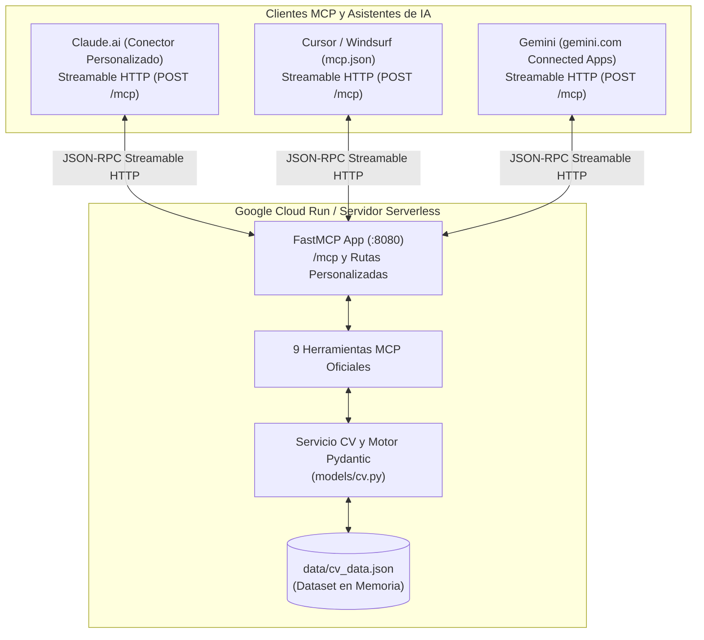

<p align="center">
  
</p>

# Servidor MCP de Ana-Catalina

[English](README.md) | [Español](README.es.md)

<p align="center">
  <a href="https://www.python.org/"></a>
  <a href="https://fastapi.tiangolo.com/"></a>
  <a href="https://modelcontextprotocol.io/"></a>
  <a href="https://cloud.google.com/run"></a>
  <a href="https://www.docker.com/"></a>
  <a href="https://docs.pytest.org/"></a>
  <a href="LICENSE"></a>
</p>

> **Servidor Oficial de Model Context Protocol (MCP)** con transporte **Streamable HTTP** sobre FastMCP, exponiendo un CV y portafolio interactivo para asistentes de IA (Claude.ai, Cursor, Windsurf, Gemini) y clientes LLM. Incluye showcase web interactivo y contenedor listo para producción en Google Cloud Run.

<div align="center">
  <h3>URL del Servidor en Vivo:</h3>
  <p><strong><a href="https://mcp.ana-catalina.com/">https://mcp.ana-catalina.com/</a></strong></p>
  <small>(Espejo en Cloud Run: <code>https://anacatalina-mcp-165536131179.us-central1.run.app/</code>)</small>
</div>

---

## Descripción del Proyecto

Este proyecto implementa un servidor oficial de **Model Context Protocol (MCP)** en Python que permite a evaluadores técnicos, reclutadores y modelos LLM (como Claude o GPT) explorar de forma interactiva y estructurada la trayectoria profesional, habilidades técnicas, proyectos insignia y compatibilidad con vacantes de **Ana-Catalina Villalobos Contardo** (Data Scientist & Machine Learning Engineer).

### Características Principales
- **Web Showcase & Playground Interactivo:** Servido en `/demo` (la raíz `/` redirige a los navegadores a la página del producto) bajo el *Pastel-Tech Design System*. Permite a reclutadores y visitantes humanos evaluar compatibilidad con vacantes y buscar en el currículum en tiempo real con latencia inferior a 5ms y resultados 100% verificables en memoria.
- **Negociación Transparente de Contenido:** Devuelve una aplicación web responsiva si la petición proviene de un navegador (`Accept: text/html`) y el JSON de descubrimiento original si proviene de agentes o APIs.
- **Transporte Moderno Streamable HTTP (`/mcp`):** Transporte nativo recomendado por la especificación MCP para conexiones directas desde **Claude.ai** (conectores personalizados), **Gemini** (gemini.com Connected Apps) y **Cursor / Windsurf** (`mcp.json`).
- **9 Herramientas MCP Especializadas:** Consulta granular de experiencia laboral, stack tecnológico con niveles de dominio, proyectos insignia, evaluación automática de vacantes, búsqueda global por palabras clave, educación, contacto y perfil general.
- **Desacoplamiento y Rendimiento:** Datos estructurados en `data/cv_data.json` validados en memoria con **Pydantic v2** al iniciar el contenedor (<2ms por consulta).

---

## Arquitectura



---

## Catálogo de Herramientas MCP

El servidor expone **9 herramientas oficiales** registradas a través del protocolo MCP:

| Herramienta | Parámetros | Tipo de Retorno | Descripción |
| :--- | :--- | :--- | :--- |
| `obtener_experiencia` | `empresa` *(str, opcional)* | `List[ExperienceItem]` | Historial laboral detallado, roles, responsabilidades y tecnologías empleadas. Permite filtrar por empresa. |
| `obtener_stack_tecnologico` | `categoria` *(str, opcional)*<br/>`nivel` *(str, opcional)* | `List[SkillCategory]` | Tecnologías, lenguajes (Python, SQL), Cloud/GCP (BigQuery, Vertex AI) y Docker organizados por categoría y nivel (Avanzado, Intermedio). |
| `obtener_proyectos_destacados` | `tipo` *(str, opcional)*<br/>`tecnologia` *(str, opcional)* | `List[ProjectItem]` | Proyectos insignia (laborales y personales), arquitectura, stack tecnológico y enlaces a repositorios/demos. |
| `evaluar_fit_puesto` | `descripcion_vacante` *(str, requerido)* | `FitEvaluationResult` | Analiza los requerimientos de una vacante laboral y calcula el porcentaje de compatibilidad, fortalezas coincidentes y propuesta de valor. |
| `buscar_en_curriculum` | `consulta` *(str, requerido)* | `Dict[str, Any]` | Búsqueda transversal por palabra clave en todo el currículum (experiencia, habilidades, proyectos y educación). |
| `obtener_educacion` | *Ninguno* | `List[EducationItem]` | Formación académica formal, grado obtenido, institución y especialización. |
| `obtener_contacto` | *Ninguno* | `ContactDetails` | Canales directos de contacto profesional (Email y perfil de LinkedIn). |
| `obtener_perfil` | *Ninguno* | `PersonalInfo` | Perfil general: nombre, cargo actual, ubicación y enlaces de portafolio (incluyendo GitHub). |
| `obtener_resumen_ejecutivo` | `idioma` *(str, default="es")* | `str` | Síntesis ejecutiva del perfil profesional enfocada en Data Science, ML, GCP y arquitecturas MCP en español (`es`) o inglés (`en`). |

---

## Aprendizajes Clave

1. **Evolución del Transporte MCP (Migración a Streamable HTTP):**
   - Inicialmente, los servidores MCP remotos dependían de combinaciones multi-endpoint basadas en Server-Sent Events (`/sse` y `/messages/`).
   - La especificación moderna de MCP estandarizó **Streamable HTTP** (`/mcp`) mediante un único endpoint unificado sobre HTTP POST que admite respuestas JSON y flujos en tiempo real (`Accept: application/json, text/event-stream`).
   - Esta arquitectura simplifica drásticamente el despliegue serverless, elimina la necesidad de mantener puentes locales (`stdio`) para clientes remotos y garantiza compatibilidad nativa directa con **Claude.ai**, **Cursor** y **Windsurf**.

2. **Desacoplamiento y Validación de Datos:**
   - La separación entre la capa de datos (`data/cv_data.json`), los contratos de interfaz (`models/cv.py`) y la lógica de negocio (`services/cv_service.py`) permite actualizar el contenido del currículum sin modificar el servidor MCP ni arriesgar la compatibilidad de tipos.

3. **Compatibilidad y Cambios de API en `mcp 2.x`:**
   - La versión `2.0.0` del SDK oficial de MCP introdujo cambios que renombraron `FastMCP`. Para mantener la estabilidad del despliegue en Cloud Run, fijamos la dependencia en `requirements.txt` a `mcp>=1.3.0,<2`.

4. **Detección Automatizada de Deriva (Upstream Drift Detection):**
   - Para mantener los datos de `data/cv_data.json` permanentemente consistentes con los repositorios fuente (`anacatalina-cv` y `projects-hub`), se diseñó un flujo automatizado de auditoría en GitHub Actions (`upstream-drift.yml`) basado en comparación semántica de contenido.

---

## Instalación y Uso Local

### 1. Clonar el Repositorio y Configurar Entorno

```bash
git clone https://github.com/AnaCataVC/anacatalina-mcp.git
cd anacatalina-mcp

# Crear y activar entorno virtual
python -m venv .venv
source .venv/bin/activate  # En Windows PowerShell: .venv\Scripts\Activate.ps1

# Instalar dependencias
pip install -r requirements.txt
pip install -r requirements-dev.txt
```

### 2. Ejecutar la Suite de Pruebas

```bash
pytest tests/ -v
```

### 3. Iniciar el Servidor MCP Local

```bash
uvicorn server:app --host 0.0.0.0 --port 8080 --reload
```

---

## Conectar Asistentes de IA

- **Claude.ai:** Ajustes → Conectores → Agregar conector personalizado → URL: `https://mcp.ana-catalina.com/mcp`
- **Cursor / Windsurf (`mcp.json`):**
  ```json
  {
    "mcpServers": {
      "anacatalina-cv": {
        "url": "https://mcp.ana-catalina.com/mcp"
      }
    }
  }
  ```

---

## Licencia

Este proyecto se distribuye bajo la licencia **MIT**. Desarrollado por **Ana-Catalina Villalobos Contardo**.

