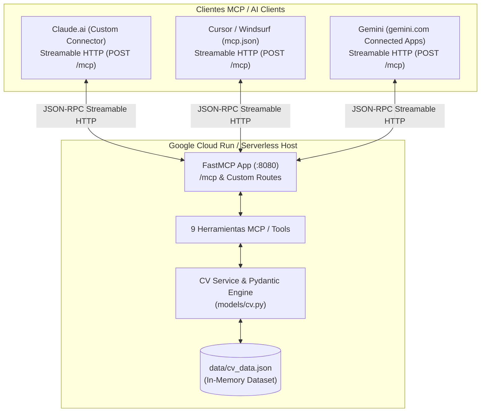

<p align="center">
  
</p>

<h1 align="center">Ana-Catalina Villalobos Contardo &mdash; Interactive Curriculum MCP Server</h1>

<p align="center">
  <a href="https://www.python.org/"></a>
  <a href="https://fastapi.tiangolo.com/"></a>
  <a href="https://modelcontextprotocol.io/"></a>
  <a href="https://cloud.google.com/run"></a>
  <a href="https://www.docker.com/"></a>
  <a href="https://docs.pytest.org/"></a>
  <a href="LICENSE"></a>
</p>

> **Official Model Context Protocol (MCP) Server** with **Streamable HTTP** transport over FastMCP, exposing an interactive CV and portfolio for AI assistants (Claude.ai, Cursor, Windsurf) and LLM clients. Includes a self-contained web showcase and a production-ready container for Google Cloud Run.

<div align="center">
  <h3>🟢 Live Server URL / Servidor en Vivo:</h3>
  <p><strong><a href="https://mcp.ana-catalina.com/">https://mcp.ana-catalina.com/</a></strong></p>
  <small>(Cloud Run Mirror: <code>https://anacatalina-mcp-165536131179.us-central1.run.app/</code>)</small>
</div>

---

## Descripción del Proyecto (Spanish)

Este proyecto implementa un servidor oficial de **Model Context Protocol (MCP)** en Python que permite a evaluadores técnicos, reclutadores y modelos LLM (como Claude o GPT) explorar de forma interactiva y estructurada la trayectoria profesional, habilidades técnicas, proyectos insignia y compatibilidad con vacantes de **Ana-Catalina Villalobos Contardo** (Data Scientist & Machine Learning Engineer).

### Características Principales
- **Web Showcase & Playground Interactivo:** Servido en la raíz (`/`) y `/demo` bajo el *Pastel-Tech Design System*. Permite a reclutadores y visitantes humanos evaluar compatibilidad con vacantes y buscar en el currículum en tiempo real con latencia inferior a 5ms y resultados 100% verificables en memoria.
- **Negociación Transparente de Contenido:** Devuelve una aplicación web responsiva si la petición proviene de un navegador (`Accept: text/html`) y el JSON de descubrimiento original si proviene de agentes o APIs.
- **Transporte Moderno Streamable HTTP (`/mcp`):** Transporte nativo recomendado por la especificación MCP para conexiones directas desde **Claude.ai** (conectores personalizados), **Gemini** (gemini.com Connected Apps) y **Cursor / Windsurf** (`mcp.json`).
- **9 Herramientas MCP Especializadas:** Consulta granular de experiencia laboral, stack tecnológico con niveles de dominio, proyectos insignia, evaluación automática de vacantes, búsqueda global por palabras clave, educación, contacto y perfil general.
- **Desacoplamiento y Rendimiento:** Datos estructurados en `data/cv_data.json` validados en memoria con **Pydantic v2** al iniciar el contenedor (<2ms por consulta).

---

## Project Overview (English)

This project provides an official **Model Context Protocol (MCP)** server built in Python that enables AI assistants, hiring managers, and evaluators to interactively query the professional experience, technical skill matrix, featured projects, and job compatibility of **Ana-Catalina Villalobos Contardo** (Data Scientist & Machine Learning Engineer).

### Key Features
- **Interactive Web Showcase & Playground:** Served at `/` and `/demo` using the *Pastel-Tech Design System*. Allows human visitors and evaluators to test job fit and query the curriculum directly in the browser with deterministic accuracy and instant in-memory responses.
- **Transparent HTTP Content Negotiation:** Serves the interactive web interface to browsers (`Accept: text/html`) while preserving the structured JSON discovery payload for programmatic agents and curl.
- **Modern Streamable HTTP Transport (`/mcp`):** Native transport standard for direct cloud connections from **Claude.ai** (custom connectors), **Gemini** (gemini.com Connected Apps) and **Cursor / Windsurf** (`mcp.json`).
- **9 Dedicated MCP Tools:** Granular exploration of work history, skill taxonomy by category/level, highlighted projects, automated job fit scoring, full-text curriculum search, education, contact details, and general profile.
- **Zero-Latency In-Memory Architecture:** Clean data validation using **Pydantic v2** loaded into memory on container startup (<2ms response time).

---

## 📐 Arquitectura del Sistema / System Architecture



---

## 🧰 Catálogo de Herramientas MCP / MCP Tools Catalog

El servidor expone **9 herramientas oficiales** registradas a través del protocolo MCP:

| Herramienta / Tool | Parámetros / Parameters | Tipo Retorno / Return Type | Descripción / Description |
| :--- | :--- | :--- | :--- |
| `obtener_experiencia` | `empresa` *(str, opcional)* | `List[ExperienceItem]` | Historial laboral detallado, roles, responsabilidades y tecnologías empleadas. Permite filtrar por empresa. |
| `obtener_stack_tecnologico` | `categoria` *(str, opcional)*<br/>`nivel` *(str, opcional)* | `List[SkillCategory]` | Tecnologías, lenguajes (Python, SQL), Cloud/GCP (BigQuery, Vertex AI) y Docker organizados por categoría y nivel (Avanzado, Intermedio). |
| `obtener_proyectos_destacados` | `tipo` *(str, opcional)*<br/>`tecnologia` *(str, opcional)* | `List[ProjectItem]` | Proyectos insignia (laborales y personales), arquitectura, stack tecnológico y enlaces a repositorios/demos. |
| `evaluar_fit_puesto` | `descripcion_vacante` *(str, requerido)* | `FitEvaluationResult` | Analiza los requerimientos de una vacante laboral y calcula el porcentaje de compatibilidad, fortalezas coincidentes y propuesta de valor. |
| `buscar_en_curriculum` | `consulta` *(str, requerido)* | `Dict[str, Any]` | Búsqueda transversal por palabra clave en todo el currículum (experiencia, habilidades, proyectos y educación). |
| `obtener_educacion` | *Ninguno* | `List[EducationItem]` | Formación académica formal, grado obtenido, institución y especialización. |
| `obtener_contacto` | *Ninguno* | `ContactDetails` | Canales directos de contacto profesional (Email y perfil de LinkedIn). |
| `obtener_perfil` | *Ninguno* | `PersonalInfo` | Perfil general: nombre, cargo actual, ubicación y enlaces de portafolio (incluyendo GitHub). |
| `obtener_resumen_ejecutivo` | `idioma` *(str, default="es")* | `str` | Síntesis ejecutiva del perfil profesional enfocada en Data Science, ML, GCP y arquitecturas MCP en español (`es`) o inglés (`en`). |

---

## 💡 Aprendizajes Clave & Decisiones de Diseño

1. **Evolución del Transporte MCP (Migración a Streamable HTTP):**
   - Inicialmente, los servidores MCP remotos dependían de combinaciones multi-endpoint basadas en Server-Sent Events (`/sse` y `/messages/`).
   - La especificación moderna de MCP estandarizó **Streamable HTTP** (`/mcp`) mediante un único endpoint unificado sobre HTTP POST que admite respuestas JSON y flujos en tiempo real (`Accept: application/json, text/event-stream`).
   - Esta arquitectura simplifica drásticamente el despliegue serverless, elimina la necesidad de mantener puentes locales (`stdio`) para clientes remotos y garantiza compatibilidad nativa directa con **Claude.ai** (conectores personalizados) y **Cursor / Windsurf** (`mcp.json`).

2. **Desacoplamiento y Validación de Datos:**
   - La separación entre la capa de datos (`data/cv_data.json`), los contratos de interfaz (`models/cv.py`) y la lógica de negocio (`services/cv_service.py`) permite actualizar el contenido del currículum sin modificar el servidor MCP ni arriesgar la compatibilidad de tipos.

3. **Compatibilidad y Cambios de API en `mcp 2.x`:**
   - Recientemente, la versión `2.0.0` del SDK oficial de MCP introdujo cambios que renombraron `FastMCP`. Para mantener la estabilidad del despliegue en Cloud Run y garantizar que nuestro código `FastMCP` v1 continúe funcionando correctamente sin refactorización inmediata, fijamos la dependencia en `requirements.txt` a `mcp>=1.3.0,<2`.

---

## 🚀 Instalación y Uso Local / Local Setup

### 1. Clonar el Repositorio y Configurar Entorno

```bash
# Clonar repositorio
git clone https://github.com/AnaCataVC/anacatalina-mcp.git
cd anacatalina-mcp

# Crear y activar entorno virtual
python -m venv .venv

# Windows (PowerShell)
.venv\Scripts\Activate.ps1

# Linux / macOS
source .venv/bin/activate

# Instalar dependencias (producción)
pip install -r requirements.txt

# Instalar dependencias de desarrollo (incluye pytest, para correr la suite de pruebas)
pip install -r requirements-dev.txt
```

### 2. Ejecutar la Suite de Pruebas

```bash
pytest tests/ -v
```

### 3. Sincronización y Auditoría de Datos (`anacatalina-cv` y `projects-hub`)

```bash
# Auditar consistencia con los repositorios hermanos
python scripts/sync_mcp_data.py --audit

# Sincronizar data/cv_data.json con las últimas actualizaciones
python scripts/sync_mcp_data.py --sync
```

### 4. Iniciar el Servidor MCP Local

```bash
uvicorn server:app --host 0.0.0.0 --port 8080 --reload
```

Endpoints disponibles:
- **Web Showcase & Playground:** `http://localhost:8080/` (en navegadores) o `http://localhost:8080/demo`
- **Discovery JSON:** `http://localhost:8080/` (con cabecera `Accept: application/json` o agentes MCP)
- **Health Check:** `http://localhost:8080/health`
- **Streamable HTTP (MCP Endpoint):** `http://localhost:8080/mcp` &mdash; para Claude.ai, Cursor y Windsurf
- **APIs REST Auxiliares (Integraciones HTTP directas / Scripts):**
  - `POST /api/evaluate-fit` &mdash; Evaluación determinista de vacantes vía HTTP
  - `GET /api/search?q={query}` &mdash; Búsqueda transversal por palabras clave vía HTTP
  - `GET /api/skills` &mdash; Taxonomía de stack y niveles técnicos
  - `GET /api/projects` &mdash; Proyectos destacados (laborales y personales)

---

## 🤖 Conectar Asistentes de IA / AI Clients Setup

### 1. Claude.ai (Conector Personalizado)
1. En Claude.ai: **Ajustes → Conectores → Agregar conector personalizado**
2. Nombre: `Ana-Catalina MCP`
3. URL del servidor:
```
https://mcp.ana-catalina.com/mcp
```
4. Autenticación: **Ninguna** (servidor de portafolio público)

> [!TIP]
> **En desarrollo local:** usa `http://localhost:8080/mcp` como URL del conector.

### 2. Gemini (gemini.com &mdash; Connected Apps)
1. En [gemini.google.com](https://gemini.google.com): **Settings & help → Connected Apps** (si no aparece, entra primero a **Personal Intelligence → Connected Apps**).
2. En "Custom apps for Spark", haz clic en **Add a custom app**.
3. Pega la URL del servidor:
```
https://mcp.ana-catalina.com/mcp
```
4. Haz clic en **Next** y sigue las instrucciones en pantalla. Una vez conectado, invócalo escribiendo `@` en el chat.

> [!NOTE]
> Esta función (**Gemini Spark**) requiere cuenta personal de Google, 18+ años, ubicación en EE.UU. y "Keep Activity" habilitado — todavía no está disponible para todas las cuentas ni regiones.

### 3. Cursor & Windsurf (`mcp.json`)
Agrega el servidor en tu configuración de MCP (`~/.cursor/mcp.json` o settings de Cursor):

```json
{
  "mcpServers": {
    "anacatalina-cv": {
      "url": "https://mcp.ana-catalina.com/mcp"
    }
  }
}
```

---

## ☁️ Despliegue en Google Cloud Run / Cloud Run Deployment

### 1. Construir y Probar Contenedor Localmente

```bash
docker build -t anacatalina-mcp .
docker run -p 8080:8080 -e PORT=8080 anacatalina-mcp
```

### 2. Desplegar a Google Cloud Run con Google Cloud SDK (`gcloud`)

```bash
# Autenticarse en Google Cloud
gcloud auth login
gcloud config set project TU_PROJECT_ID

# Desplegar directamente desde el código fuente
gcloud run deploy anacatalina-mcp \
  --source . \
  --platform managed \
  --region us-central1 \
  --allow-unauthenticated \
  --timeout 3600
```

> [!NOTE]
> La opción `--timeout 3600` es fundamental para mantener estables las conexiones Streamable HTTP de larga duración en Cloud Run.

---

## 📄 Licencia / License

Este proyecto se distribuye bajo la licencia **MIT**. Desarrollado por **Ana-Catalina Villalobos Contardo**.
