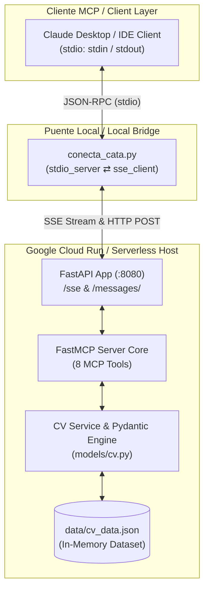

<p align="center">
  
</p>

<h1 align="center">Ana Catalina &mdash; Interactive Curriculum MCP Server</h1>

<p align="center">
  <a href="https://www.python.org/"></a>
  <a href="https://fastapi.tiangolo.com/"></a>
  <a href="https://modelcontextprotocol.io/"></a>
  <a href="https://cloud.google.com/run"></a>
  <a href="https://www.docker.com/"></a>
  <a href="https://docs.pytest.org/"></a>
  <a href="LICENSE"></a>
</p>

> **Official Model Context Protocol (MCP) Server** with Server-Sent Events (SSE) transport over FastAPI, exposing an interactive CV and portfolio for AI assistants and LLM clients. Includes a local `stdio` bridge for Claude Desktop and a production-ready container for Google Cloud Run.

---

## 🇪🇸 Descripción del Proyecto (Spanish)

Este proyecto implementa un servidor oficial de **Model Context Protocol (MCP)** en Python que permite a evaluadores técnicos, reclutadores y modelos LLM (como Claude o GPT) explorar de forma interactiva y estructurada la trayectoria profesional, habilidades técnicas, proyectos insignia y compatibilidad con vacantes de **Ana Catalina** (Data Scientist & Learning Engineer en SimpliRoute, ex-Fracttal).

### Características Principales
- **Transporte SSE Remoto:** Integrado con FastAPI y `SseServerTransport` para despliegue Serverless en Google Cloud Run.
- **8 Herramientas MCP Especializadas:** Consulta granular de experiencia laboral, stack tecnológico con niveles de dominio, proyectos insignia, evaluación automática de vacantes, búsqueda global por palabras clave, educación y contacto.
- **Script Puente Local (`conecta_cata.py`):** Permite conectar clientes locales basados en `stdio` (como Claude Desktop) con el servidor remoto alojado en Cloud Run a través de HTTP/SSE.
- **Desacoplamiento y Rendimiento:** Datos estructurados en `data/cv_data.json` validados en memoria con **Pydantic v2** al iniciar el contenedor (<2ms por consulta).

---

## 🇬🇧 Project Overview (English)

This project provides an official **Model Context Protocol (MCP)** server built in Python that enables AI assistants, hiring managers, and evaluators to interactively query the professional experience, technical skill matrix, featured projects, and job compatibility of **Ana Catalina** (Data Scientist & Learning Engineer at SimpliRoute, former Fracttal).

### Key Features
- **Remote SSE Transport:** Implemented via FastAPI and `SseServerTransport`, optimized for Serverless hosting on Google Cloud Run.
- **8 Dedicated MCP Tools:** Granular exploration of work history, skill taxonomy by category/level, highlighted projects, automated job fit scoring, full-text curriculum search, education, and contact details.
- **Local Stdio Bridge (`conecta_cata.py`):** Bi-directional async adapter connecting `stdio`-based clients (such as Claude Desktop) to remote SSE endpoints.
- **Zero-Latency In-Memory Architecture:** Clean data validation using **Pydantic v2** loaded into memory on container startup (<2ms response time).

---

## 📐 Arquitectura del Sistema / System Architecture



---

## 🧰 Catálogo de Herramientas MCP / MCP Tools Catalog

El servidor expone **8 herramientas oficiales** registradas a través del protocolo MCP:

| Herramienta / Tool | Parámetros / Parameters | Tipo Retorno / Return Type | Descripción / Description |
| :--- | :--- | :--- | :--- |
| `obtener_experiencia` | `empresa` *(str, opcional)* | `List[ExperienceItem]` | Historial laboral detallado, roles, responsabilidades y tecnologías empleadas. Permite filtrar por empresa. |
| `obtener_stack_tecnologico` | `categoria` *(str, opcional)*<br/>`nivel` *(str, opcional)* | `List[SkillCategory]` | Tecnologías, lenguajes (Python, SQL), Cloud/GCP (BigQuery, Vertex AI) y Docker organizados por categoría y nivel (Avanzado, Intermedio). |
| `obtener_proyectos_destacados` | `tipo` *(str, opcional)*<br/>`tecnologia` *(str, opcional)* | `List[ProjectItem]` | Proyectos insignia (laborales y personales), arquitectura, stack tecnológico y enlaces a repositorios/demos. |
| `evaluar_fit_puesto` | `descripcion_vacante` *(str, requerido)* | `FitEvaluationResult` | Analiza los requerimientos de una vacante laboral y calcula el porcentaje de compatibilidad, fortalezas coincidentes y propuesta de valor. |
| `buscar_en_curriculum` | `consulta` *(str, requerido)* | `Dict[str, Any]` | Búsqueda transversal por palabra clave en todo el currículum (experiencia, habilidades, proyectos y educación). |
| `obtener_educacion` | *Ninguno* | `List[EducationItem]` | Formación académica formal, grado obtenido, institución y especialización. |
| `obtener_contacto` | *Ninguno* | `ContactDetails` | Canales directos de contacto profesional (Email y perfil de LinkedIn). |
| `obtener_resumen_ejecutivo` | `idioma` *(str, default="es")* | `str` | Síntesis ejecutiva del perfil profesional enfocada en Data Science, ML, GCP y arquitecturas MCP en español (`es`) o inglés (`en`). |

---

## 💡 Aprendizajes Clave & Decisiones de Diseño

1. **Dualidad de Transporte en MCP (`stdio` vs `SSE`):**
   - Los clientes locales de escritorio como Claude Desktop operan mediante subprocesos y canales `stdin`/`stdout`.
   - Los entornos de producción serverless (Google Cloud Run) requieren streaming HTTP mediante Server-Sent Events (`/sse` y `/messages/`).
   - El script `conecta_cata.py` actúa como un puente asíncrono bidireccional construido sobre `anyio`, traduciendo eventos entre ambos mundos con latencia nula.

2. **Higiene Estricta de Streams en `stdio`:**
   - Cualquier mensaje o log emitido a `stdout` corrompe el flujo JSON-RPC del protocolo MCP.
   - Toda la telemetría, logs informativos y errores en `conecta_cata.py` se canalizan explícitamente hacia `stderr`.

3. **Desacoplamiento y Validación de Datos:**
   - La separación entre la capa de datos (`data/cv_data.json`), los contratos de interfaz (`models/cv.py`) y la lógica de negocio (`services/cv_service.py`) permite actualizar el contenido del currículum sin modificar el servidor MCP ni arriesgar la compatibilidad de tipos.

---

## 🚀 Instalación y Uso Local / Local Setup

### 1. Clonar el Repositorio y Configurar Entorno

```bash
# Clonar repositorio
git clone https://github.com/AnaCataVC/anacatalina-mcp.git
cd anacatalina-mcp

# Crear y activar entorno virtual
python -m venv .venv

# Windows (PowerShell)
.venv\Scripts\Activate.ps1

# Linux / macOS
source .venv/bin/activate

# Instalar dependencias
pip install -r requirements.txt
```

### 2. Ejecutar la Suite de Pruebas

```bash
pytest tests/ -v
```

### 3. Iniciar el Servidor MCP Local

```bash
uvicorn server:app --host 0.0.0.0 --port 8080 --reload
```

Endpoints disponibles:
- **Health Check:** `http://localhost:8080/health`
- **SSE Stream:** `http://localhost:8080/sse`
- **Mensajes POST:** `http://localhost:8080/messages/`

---

## 🔌 Configuración en Claude Desktop

Para conectar Claude Desktop con el servidor (ya sea en ejecución local o en Cloud Run), añade la configuración en tu archivo `claude_desktop_config.json`:

- **Windows:** `%APPDATA%\Claude\claude_desktop_config.json`
- **macOS:** `~/Library/Application Support/Claude/claude_desktop_config.json`

```json
{
  "mcpServers": {
    "anacatalina-cv": {
      "command": "python",
      "args": [
        "/path/to/anacatalina-mcp/conecta_cata.py"
      ],
      "env": {
        "MCP_SERVER_SSE_URL": "https://anacatalina-mcp-xxxxx-uc.a.run.app/sse"
      }
    }
  }
}
```

> [!TIP]
> **Pruebas en desarrollo local:** Para conectar Claude Desktop con tu servidor local, configura `"MCP_SERVER_SSE_URL": "http://localhost:8080/sse"`.

---

## ☁️ Despliegue en Google Cloud Run / Cloud Run Deployment

### 1. Construir y Probar Contenedor Localmente

```bash
docker build -t anacatalina-mcp .
docker run -p 8080:8080 -e PORT=8080 anacatalina-mcp
```

### 2. Desplegar a Google Cloud Run con Google Cloud SDK (`gcloud`)

```bash
# Autenticarse en Google Cloud
gcloud auth login
gcloud config set project TU_PROJECT_ID

# Desplegar directamente desde el código fuente
gcloud run deploy anacatalina-mcp \
  --source . \
  --platform managed \
  --region us-central1 \
  --allow-unauthenticated \
  --timeout 3600 \
  --session-affinity
```

> [!NOTE]
> Las opciones `--timeout 3600` y `--session-affinity` son fundamentales para mantener conexiones SSE persistentes y estables en Cloud Run.

---

## 📂 Estructura del Proyecto / Repository Structure

```text
anacatalina-mcp/
├── data/
│   └── cv_data.json             # Dataset estructurado del currículum profesional
├── models/
│   ├── __init__.py
│   └── cv.py                    # Modelos de datos y validación con Pydantic v2
├── services/
│   ├── __init__.py
│   └── cv_service.py            # Lógica de filtrado, búsqueda y evaluación de fit
├── tests/
│   └── test_server.py           # Pruebas de integración del servidor MCP
├── .gitignore                   # Exclusiones de Git
├── .dockerignore               # Exclusiones de Docker build
├── Dockerfile                   # Definición de contenedor lista para Cloud Run
├── README.md                    # Documentación principal del repositorio
├── claude_desktop_config.example.json  # Plantilla de configuración para Claude Desktop
├── conecta_cata.py              # Script puente asíncrono stdio <-> SSE
├── icon.png                     # Icono / Banner oficial del proyecto
├── requirements.txt             # Dependencias del proyecto
└── server.py                    # Servidor principal FastMCP con transporte SSE y FastAPI
```

---

## 📄 Licencia / License

Este proyecto se distribuye bajo la licencia **MIT**. Desarrollado por **Ana Catalina**.
