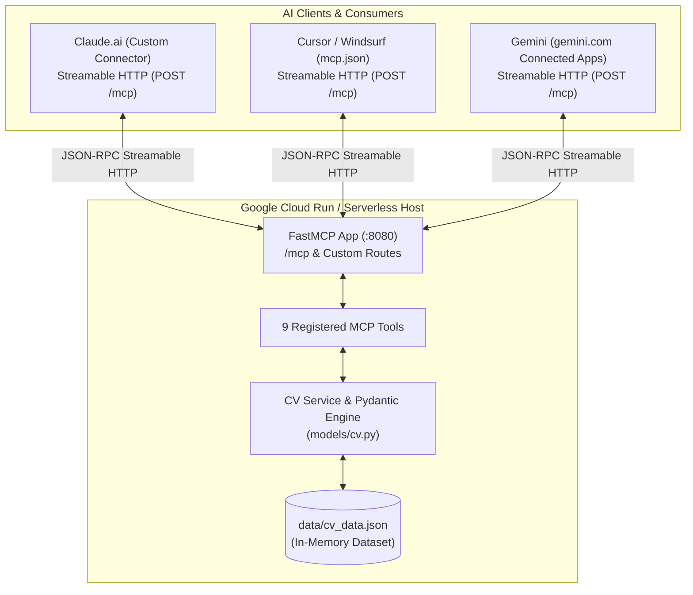

<p align="center">
  
</p>

# Ana-Catalina MCP Server

[English](README.md) | [Español](README.es.md)

<p align="center">
  <a href="https://www.python.org/"></a>
  <a href="https://fastapi.tiangolo.com/"></a>
  <a href="https://modelcontextprotocol.io/"></a>
  <a href="https://cloud.google.com/run"></a>
  <a href="https://www.docker.com/"></a>
  <a href="https://docs.pytest.org/"></a>
  <a href="LICENSE"></a>
</p>

> **Official Model Context Protocol (MCP) Server** with **Streamable HTTP** transport over FastMCP, exposing an interactive CV and portfolio for AI assistants (Claude.ai, Cursor, Windsurf, Gemini) and LLM clients. Includes a self-contained web showcase and a production-ready container for Google Cloud Run.

<div align="center">
  <h3>Live Server URL:</h3>
  <p><strong><a href="https://mcp.ana-catalina.com/">https://mcp.ana-catalina.com/</a></strong></p>
  <small>(Cloud Run Mirror: <code>https://anacatalina-mcp-165536131179.us-central1.run.app/</code>)</small>
</div>

---

## Project Description

This project provides an official **Model Context Protocol (MCP)** server built in Python that enables AI assistants, hiring managers, and technical evaluators to interactively query the professional experience, technical skill matrix, featured projects, and job compatibility of **Ana-Catalina Villalobos Contardo** (Data Scientist & Machine Learning Engineer).

### Key Features
- **Interactive Web Showcase & Playground:** Served at `/demo` (browsers hitting `/` are redirected to the product page) using the *Pastel-Tech Design System*. Allows human visitors and evaluators to test job fit and query the curriculum directly in the browser with deterministic accuracy and instant in-memory responses.
- **Transparent HTTP Content Negotiation:** Serves the interactive web interface to browsers (`Accept: text/html`) while preserving the structured JSON discovery payload for programmatic agents and curl.
- **Modern Streamable HTTP Transport (`/mcp`):** Native transport standard for direct cloud connections from **Claude.ai** (custom connectors), **Gemini** (gemini.com Connected Apps) and **Cursor / Windsurf** (`mcp.json`).
- **9 Dedicated MCP Tools:** Granular exploration of work history, skill taxonomy by category/level, highlighted projects, automated job fit scoring, full-text curriculum search, education, contact details, and general profile.
- **Zero-Latency In-Memory Architecture:** Clean data validation using **Pydantic v2** loaded into memory on container startup (<2ms response time).

---

## Architecture


```mermaid
flowchart TD
    subgraph ClientLayer["AI Clients & Consumers"]
        A["Claude.ai (Custom Connector)<br/>Streamable HTTP (POST /mcp)"]
        B["Cursor / Windsurf (mcp.json)<br/>Streamable HTTP (POST /mcp)"]
        G["Gemini (gemini.com Connected Apps)<br/>Streamable HTTP (POST /mcp)"]
    end

    subgraph CloudLayer["Google Cloud Run / Serverless Host"]
        C["FastMCP App (:8080)<br/>/mcp & Custom Routes"]
        D["9 Registered MCP Tools"]
        E["CV Service & Pydantic Engine<br/>(models/cv.py)"]
        F[("data/cv_data.json<br/>(In-Memory Dataset)")]
    end

    A <-->|"JSON-RPC Streamable HTTP"| C
    B <-->|"JSON-RPC Streamable HTTP"| C
    G <-->|"JSON-RPC Streamable HTTP"| C
    C <--> D
    D <--> E
    E <--> F
```

---

## MCP Tools Catalog

The server exposes **9 official tools** registered via the Model Context Protocol:

| Tool | Parameters | Return Type | Description |
| :--- | :--- | :--- | :--- |
| `obtener_experiencia` | `empresa` *(str, optional)* | `List[ExperienceItem]` | Detailed employment history, roles, responsibilities, and technologies used. Filterable by company. |
| `obtener_stack_tecnologico` | `categoria` *(str, optional)*<br/>`nivel` *(str, optional)* | `List[SkillCategory]` | Technologies, languages (Python, SQL), Cloud/GCP (BigQuery, Vertex AI) and Docker by category and level. |
| `obtener_proyectos_destacados` | `tipo` *(str, optional)*<br/>`tecnologia` *(str, optional)* | `List[ProjectItem]` | Highlighted portfolio projects, architecture, stack, and live demos/repo links. |
| `evaluar_fit_puesto` | `descripcion_vacante` *(str, required)* | `FitEvaluationResult` | Evaluates job requirements and calculates compatibility score, matching strengths, and value proposition. |
| `buscar_en_curriculum` | `consulta` *(str, required)* | `Dict[str, Any]` | Cross-cutting keyword search across experience, skills, projects, and education. |
| `obtener_educacion` | *None* | `List[EducationItem]` | Formal university degrees, institutions, and specializations. |
| `obtener_contacto` | *None* | `ContactDetails` | Direct professional contact channels (Email, LinkedIn). |
| `obtener_perfil` | *None* | `PersonalInfo` | General profile: name, title, location, and portfolio links. |
| `obtener_resumen_ejecutivo` | `idioma` *(str, default="es")* | `str` | Executive career summary focused on Data Science, ML, GCP, and MCP architecture in English or Spanish. |

---

## Key Learnings

1. **MCP Transport Evolution (Migration to Streamable HTTP):**
   - Traditional remote MCP servers relied on complex multi-endpoint SSE combinations (`/sse` and `/messages/`).
   - The modern MCP specification introduced **Streamable HTTP** (`/mcp`) via a single unified HTTP POST endpoint supporting both JSON responses and streaming events (`Accept: application/json, text/event-stream`).
   - This eliminates local `stdio` bridge overhead for remote clients and enables direct cloud connections from Claude.ai, Cursor, and Windsurf.

2. **Decoupled Architecture & Schema Validation:**
   - Separating raw data (`data/cv_data.json`), interface contracts (`models/cv.py`), and domain services (`services/cv_service.py`) ensures that CV content updates never compromise server stability or type safety.

3. **Pinned Stability Across MCP SDK Versions:**
   - Version 2.0 of the official MCP SDK introduced breaking renames to `FastMCP`. Pinning `mcp>=1.3.0,<2` preserves Cloud Run production stability without forced premature rewrites.

4. **Automated Upstream Drift Detection:**
   - Built a GitHub Actions workflow (`upstream-drift.yml`) using semantic content comparison to detect discrepancies and missing keys between `data/cv_data.json` and sibling repositories (`anacatalina-cv`, `projects-hub`).

---

## Local Setup & Development

### 1. Clone Repository & Setup Virtual Environment

```bash
git clone https://github.com/AnaCataVC/anacatalina-mcp.git
cd anacatalina-mcp

# Create and activate virtual environment
python -m venv .venv
source .venv/bin/activate  # On Windows PowerShell: .venv\Scripts\Activate.ps1

# Install dependencies
pip install -r requirements.txt
pip install -r requirements-dev.txt
```

### 2. Run Test Suite

```bash
pytest tests/ -v
```

### 3. Start Local MCP Server

```bash
uvicorn server:app --host 0.0.0.0 --port 8080 --reload
```

---

## Connecting AI Assistants

- **Claude.ai:** Settings → Connectors → Add custom connector → URL: `https://mcp.ana-catalina.com/mcp`
- **Cursor / Windsurf (`mcp.json`):**
  ```json
  {
    "mcpServers": {
      "anacatalina-cv": {
        "url": "https://mcp.ana-catalina.com/mcp"
      }
    }
  }
  ```

---

## License

This project is licensed under the MIT License. See [LICENSE](LICENSE) for details.

